# Asana Clone

> **Disclaimer**: This is an unofficial, open-source clone built for learning and portfolio purposes. It is not affiliated with, endorsed by, or connected to [Asana, Inc.](https://asana.com) in any way.

Asana風のタスク管理アプリケーション。Go (DDD) + Next.js + PostgreSQL + Redis で構築。

## Tech Stack

| レイヤー | 技術 |
|---------|------|
| Frontend | Next.js 16 / React 19 / TailwindCSS v4 / TanStack Query |
| Backend | Go (chi router) / DDD アーキテクチャ |
| Database | PostgreSQL 16 |
| Cache | Redis 7 |
| Infra | Docker Compose |

## システム全体像

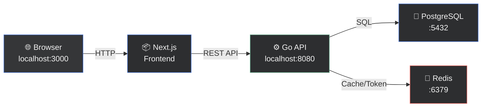

## プロジェクト構成

```
asana/
├── frontend/               # Next.js (App Router)
│   └── src/
│       ├── app/            # ページ (dashboard, projects, login, etc.)
│       ├── components/     # UIコンポーネント
│       ├── lib/            # API クライアント, Providers
│       └── types/          # TypeScript 型定義
│
├── backend/                # Go API サーバー
│   ├── cmd/api/            # エントリーポイント (main.go)
│   ├── config/             # 環境変数読み込み
│   ├── migrations/         # PostgreSQL マイグレーション + シードデータ
│   └── internal/
│       ├── domain/         # ① ビジネスルール (エンティティ, リポジトリIF)
│       ├── application/    # ② ユースケース (サービス層)
│       ├── infrastructure/ # ③ 外部接続 (PostgreSQL, Redis, JWT)
│       └── interfaces/     # ④ HTTP ハンドラー, ミドルウェア
│
├── docker/                 # Docker 設定 (postgres init.sql)
└── docker-compose.yml      # 全サービス定義
```

## クイックスタート

```bash
# 全サービス起動
docker compose up -d

# 確認
curl http://localhost:8080/health   # Backend
open http://localhost:3000           # Frontend
```

| サービス | URL |
|---------|-----|
| Frontend | http://localhost:3000 |
| Backend API | http://localhost:8080 |
| PostgreSQL | localhost:5432 |
| Redis | localhost:6379 |

**デモアカウント**: `demo@example.com` / `password123`

## バックエンドのローカル開発

```bash
cd backend
make dev          # go run ./cmd/api
make build        # バイナリビルド
make migrate-up   # マイグレーション適用
make tidy         # go mod tidy
```

## フロントエンドのローカル開発

```bash
cd frontend
npm run dev       # localhost:3000
npm run build     # プロダクションビルド
npm run lint      # ESLint
```

---

## DDD (Domain-Driven Design) アーキテクチャ

### 4層の構造と依存方向

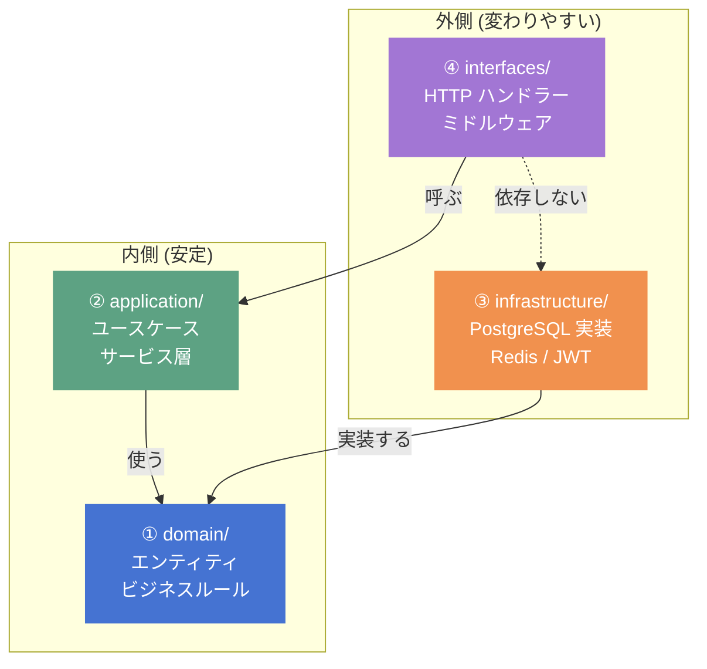

> **ルール**: 依存は常に **内側 (domain) に向かう**。domain は他の層を一切知らない。

### 各層の役割

| 層 | 場所 | 役割 | 例 |
|---|---|---|---|
| ① **domain** | `internal/domain/` | 「何が正しいか」のルール | パスワード8文字以上、ステータス遷移 |
| ② **application** | `internal/application/` | 「何をどの順番でやるか」の手順 | ユーザー作成→トークン発行→返す |
| ③ **infrastructure** | `internal/infrastructure/` | domain のインターフェースを実装 | SQL INSERT、Redis SET |
| ④ **interfaces** | `internal/interfaces/` | HTTP リクエストの受付・返却 | JSON パース、レスポンス整形 |

### リクエストの処理フロー

`POST /api/v1/projects/{id}/tasks` でタスクを作成する場合:

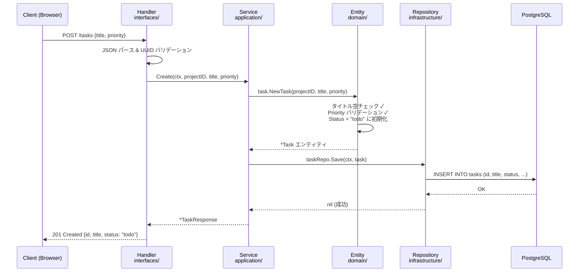

### タスクのステータス遷移 (状態機械)

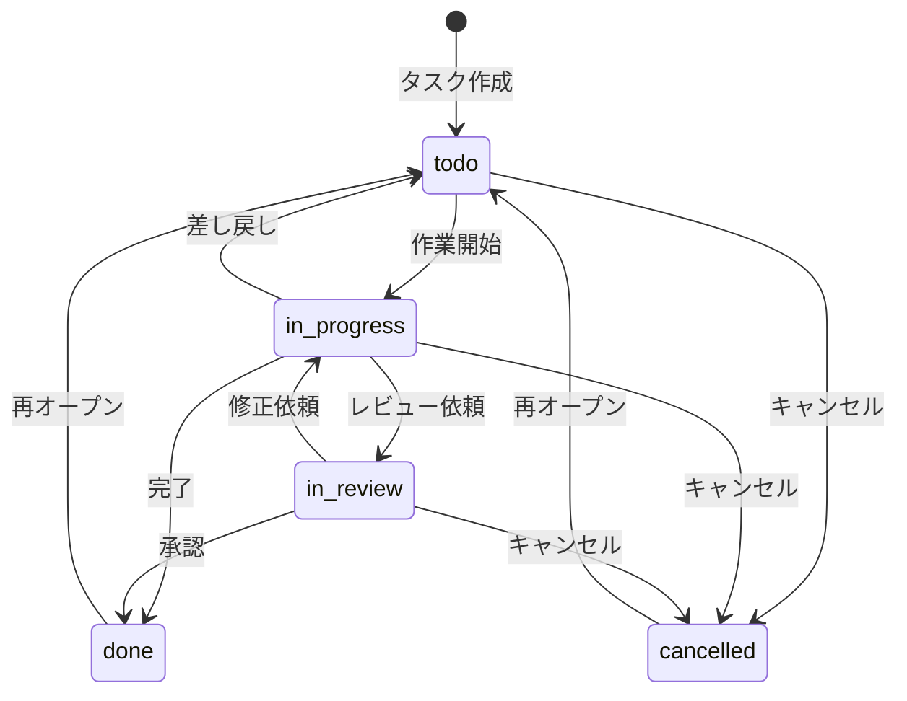

> この遷移ルールは `domain/task/entity.go` の `ChangeStatus()` メソッドで強制される。
> application 層や interfaces 層からは迂回できない。

### 各層の詳細

#### ① domain/ — ビジネスルール (心臓部)

**「何が正しいか」を定義する。DB も HTTP も知らない純粋なロジック。**

```
domain/
├── shared/       # 共通型 (ID, DomainError)
├── user/         # User エンティティ, UserRepository IF
├── workspace/    # Workspace + Member エンティティ
├── project/      # Project エンティティ
├── section/      # Section エンティティ (カンバン列)
├── task/         # Task エンティティ (ステータス遷移ルール)
├── comment/      # Comment エンティティ
└── label/        # Label エンティティ
```

**例: Task のステータス遷移ルール** (`domain/task/entity.go`)

```go
func (t *Task) ChangeStatus(newStatus Status) error {
    if !isValidTransition(t.Status, newStatus) {
        return shared.NewDomainError("INVALID_STATUS_TRANSITION", "...")
    }
    t.Status = newStatus
    t.UpdatedAt = time.Now()
    return nil
}
```

**例: Repository インターフェース** (`domain/task/repository.go`)

```go
// domain は「こういう操作が必要」とだけ定義 (実装は書かない)
type TaskRepository interface {
    FindByID(ctx context.Context, id shared.ID) (*Task, error)
    Save(ctx context.Context, task *Task) error
    Delete(ctx context.Context, id shared.ID) error
}
```

#### ② application/ — ユースケース (指揮者)

**「何をどの順番でやるか」を組み立てる。domain のルールに従いながら手順を実行。**

```
application/
├── auth/         # Register, Login
├── user/         # GetProfile, UpdateProfile
├── workspace/    # Create, AddMember, RemoveMember
├── project/      # Create (デフォルトセクション自動作成), Archive
├── section/      # Create, Reorder
├── task/         # Create, ChangeStatus, Assign, Move
└── comment/      # AddComment, EditComment
```

**例: タスク作成の流れ** (`application/task/service.go`)

```go
func (s *TaskService) Create(ctx, projectID, sectionID, title, priority) (*TaskResponse, error) {
    // 1. domain のファクトリでエンティティ作成 (バリデーション込み)
    task, err := task.NewTask(projectID, sectionID, title, priority)
    if err != nil {
        return nil, err  // domain が「タイトル空」等をはじく
    }

    // 2. Repository で保存 (実装は infrastructure が担当)
    if err := s.taskRepo.Save(ctx, task); err != nil {
        return nil, err
    }

    // 3. レスポンス用 DTO に変換して返す
    return toTaskResponse(task), nil
}
```

#### ③ infrastructure/ — 外部接続 (実装担当)

**domain が定義したインターフェースを実際に実装する。**

```
infrastructure/
├── persistence/
│   ├── postgres/     # UserRepository, TaskRepository 等の SQL 実装
│   └── redis/        # トークンストア, キャッシュ
└── auth/
    └── jwt.go        # JWT トークン生成・検証
```

**例: TaskRepository の PostgreSQL 実装** (`infrastructure/persistence/postgres/task_repository.go`)

```go
func (r *TaskRepository) Save(ctx context.Context, t *task.Task) error {
    query := `INSERT INTO tasks (id, title, status, ...) VALUES ($1, $2, $3, ...)
              ON CONFLICT (id) DO UPDATE SET ...`
    _, err := r.pool.Exec(ctx, query, t.ID, t.Title, t.Status, ...)
    return err
}
```

#### ④ interfaces/ — HTTP 受付 (入り口)

**外部からのリクエストを受け取り、application に渡し、結果を HTTP レスポンスとして返す。**

```
interfaces/http/
├── handler/       # 各リソースのハンドラー (auth, task, project, ...)
├── middleware/     # 認証, CORS, ロギング
└── server.go      # ルーティング定義
```

**例: タスク作成ハンドラー** (`interfaces/http/handler/task_handler.go`)

```go
func (h *TaskHandler) CreateTask(w http.ResponseWriter, r *http.Request) {
    // 1. HTTPリクエストから JSON パース
    var req createTaskRequest
    json.NewDecoder(r.Body).Decode(&req)

    // 2. application サービスに委譲 (ビジネスロジックには触れない)
    task, err := h.taskService.Create(r.Context(), req.ProjectID, ...)
    if err != nil {
        httpErrors.RespondWithError(w, err)
        return
    }

    // 3. JSON レスポンスを返す
    httpErrors.RespondWithJSON(w, http.StatusCreated, task)
}
```

### MVC との比較

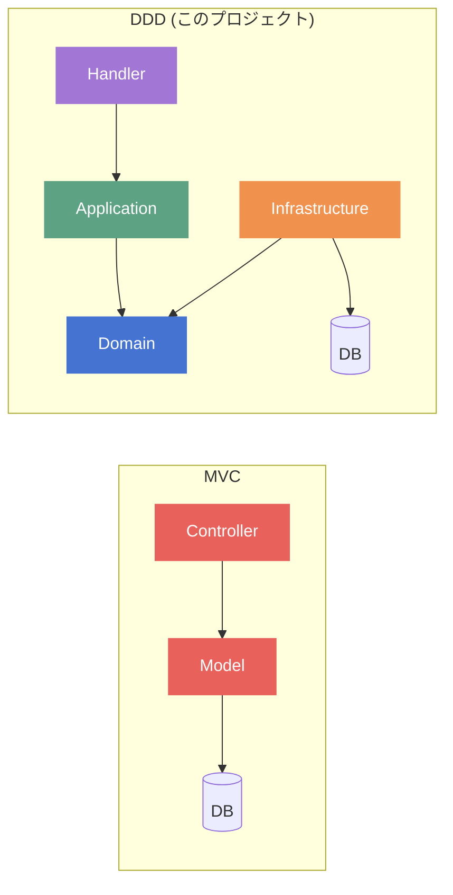

| 課題 | MVC だと | DDD だと |
|------|---------|---------|
| Controller が肥大化 | 全ロジックが Controller に集中 | handler は薄く、ロジックは application/domain に分離 |
| ビジネスルールが散らばる | Controller A と B で同じバリデーション | domain に集約、一箇所で管理 |
| DB 変更の影響 | Model 変更が全体に波及 | infrastructure だけ変更、domain は不変 |
| テストが難しい | DB 接続必須 | domain は pure ロジック、モック不要でテスト可能 |

### 依存性注入の流れ

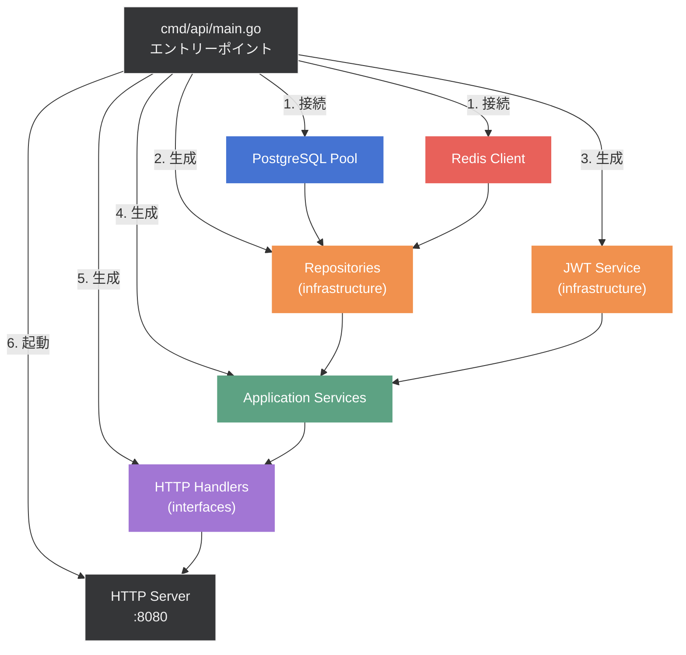

> `main.go` でフレームワーク不要の手動 DI。接続 → リポジトリ → サービス → ハンドラーの順に組み立て。

---

## ドメインモデル (ER図)

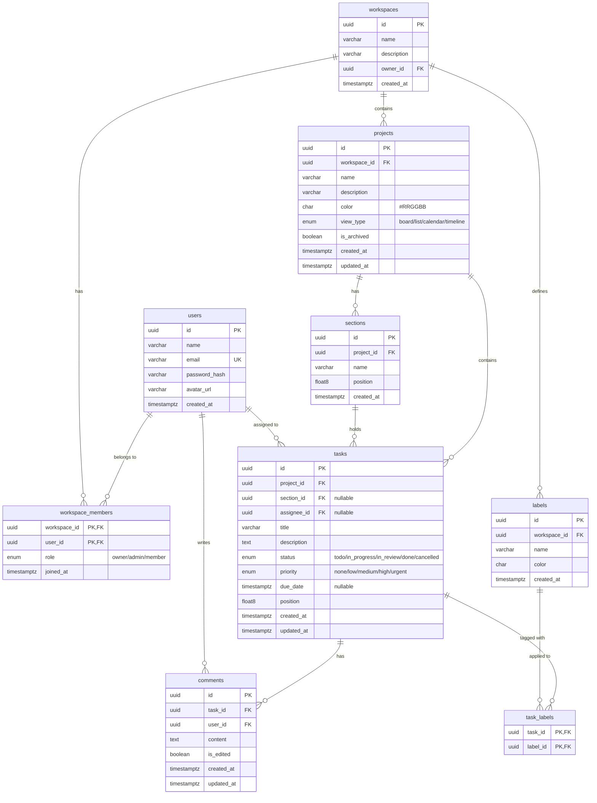

| エンティティ | 主なビジネスルール |
|-------------|-----------------|
| User | パスワード 8 文字以上、email ユニーク、bcrypt ハッシュ |
| Workspace | オーナーは削除不可、メンバー追加/削除の権限チェック |
| Project | アーカイブ/アンアーカイブ、ビュー切替 (board/list) |
| Section | Position (float) による並び替え、リバランス |
| Task | ステータス遷移の状態機械、ラベル最大数制限 |
| Comment | 編集は作者のみ、IsEdited フラグ |

---

## API エンドポイント

### 認証 (Public)
| Method | Path | 説明 |
|--------|------|------|
| POST | `/api/v1/auth/register` | ユーザー登録 |
| POST | `/api/v1/auth/login` | ログイン |

### ユーザー
| Method | Path | 説明 |
|--------|------|------|
| GET | `/api/v1/users/me` | 自分の情報 |
| PATCH | `/api/v1/users/me` | プロフィール更新 |

### ワークスペース
| Method | Path | 説明 |
|--------|------|------|
| GET | `/api/v1/workspaces` | 一覧 |
| POST | `/api/v1/workspaces` | 作成 |
| GET | `/api/v1/workspaces/:id` | 詳細 |
| POST | `/api/v1/workspaces/:id/members` | メンバー追加 |

### プロジェクト
| Method | Path | 説明 |
|--------|------|------|
| GET | `/api/v1/workspaces/:wid/projects` | 一覧 |
| POST | `/api/v1/workspaces/:wid/projects` | 作成 |
| PATCH | `/api/v1/workspaces/:wid/projects/:id` | 更新 |

### セクション
| Method | Path | 説明 |
|--------|------|------|
| GET | `/api/v1/projects/:pid/sections` | 一覧 |
| POST | `/api/v1/projects/:pid/sections` | 作成 |
| POST | `/api/v1/projects/:pid/sections/reorder` | 並び替え |

### タスク
| Method | Path | 説明 |
|--------|------|------|
| GET | `/api/v1/projects/:pid/tasks` | 一覧 (フィルタ対応) |
| POST | `/api/v1/projects/:pid/tasks` | 作成 |
| GET | `/api/v1/tasks/:id` | 詳細 |
| PATCH | `/api/v1/tasks/:id` | 更新 |
| POST | `/api/v1/tasks/:id/status` | ステータス変更 |
| POST | `/api/v1/tasks/:id/move` | セクション移動 |
| POST | `/api/v1/tasks/:id/assign` | アサイン |

### コメント
| Method | Path | 説明 |
|--------|------|------|
| GET | `/api/v1/tasks/:tid/comments` | 一覧 |
| POST | `/api/v1/tasks/:tid/comments` | 追加 |
| PATCH | `/api/v1/tasks/:tid/comments/:id` | 編集 |
| DELETE | `/api/v1/tasks/:tid/comments/:id` | 削除 |

---

## DB スキーマ

マイグレーションファイル: `backend/migrations/`

| # | ファイル | 内容 |
|---|---------|------|
| 1 | `000001_create_users` | users テーブル |
| 2 | `000002_create_workspaces` | workspaces + workspace_members |
| 3 | `000003_create_labels` | labels テーブル |
| 4 | `000004_create_projects` | projects テーブル |
| 5 | `000005_create_sections` | sections テーブル |
| 6 | `000006_create_tasks` | tasks + task_labels |
| 7 | `000007_create_comments` | comments テーブル |
| 8 | `000008_create_indexes` | 部分インデックス, GIN 全文検索 |
| 9 | `000009_seed_data` | デモデータ |

---

## Asana ドメイン知識

### Asana とは

Asana は 2008 年に Facebook の共同創業者 Dustin Moskovitz と Justin Rosenstein が設立したプロジェクト管理・ワークマネジメントツール。「チームの仕事を整理し、管理し、追跡する」ことに特化した SaaS。

### 料金プラン (2026年現在)

| プラン | 月額 | 対象 |
|-------|------|------|
| **Personal** | 無料 | 個人〜2人の小規模プロジェクト |
| **Starter** | $10.99/ユーザー | 成長中のチーム。進捗追跡、期限管理 |
| **Advanced** | $24.99/ユーザー | 部門横断のポートフォリオ・目標管理 |
| **Enterprise** | 要問い合わせ | 部門間の複雑なワークフロー自動化 |
| **Enterprise+** | 要問い合わせ | 厳格なコンプライアンス要件対応 |

**AI Studio** (追加オプション):
- Basic: Starter 以上に付属 (レート制限あり)
- Plus: 個人・小規模チーム向け有料
- Pro: 大規模ワークフロー自動化向け有料 (年額プランのみ)

> 出典: [Asana Pricing](https://asana.com/pricing)

### 核となるドメインモデル

Asana の世界観は以下の階層構造で成り立っている:

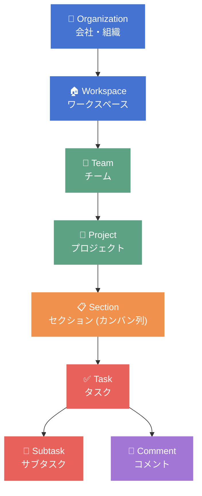

### 主要概念の解説

| 概念 | 説明 | このクローンでの実装 |
|------|------|-------------------|
| **Workspace** | ユーザーが所属する作業空間。全データのルート | `workspaces` テーブル + `workspace_members` |
| **Project** | 目的ごとの作業単位 (例: "Q2マーケティング") | `projects` テーブル。ビュー切替対応 |
| **Section** | Project 内のカテゴリ分け。ボードビューではカンバン列になる | `sections` テーブル。float position で並び順管理 |
| **Task** | 作業の最小単位。担当者・期限・優先度を持つ | `tasks` テーブル。ステータス状態機械 |
| **Assignee** | タスクの担当者。1タスクにつき1人 | `tasks.assignee_id` → `users.id` |
| **Label/Tag** | タスクの横断的な分類 (例: "バグ", "デザイン") | `labels` + `task_labels` 中間テーブル |
| **Comment** | タスクへのコメント・やり取り | `comments` テーブル |

### ビュータイプ

Asana はプロジェクトに対して複数のビュー (見え方) を提供する:

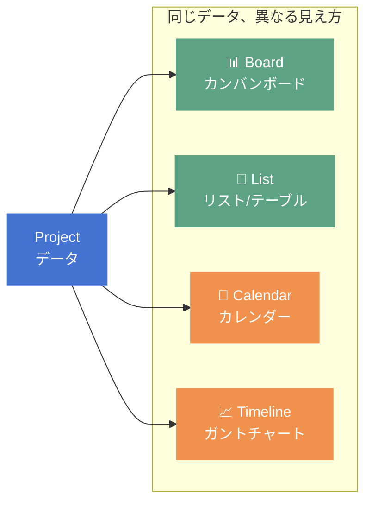

| ビュー | 用途 | このクローンでの実装 |
|-------|------|-------------------|
| **Board** | カンバン方式。セクション = 列、タスク = カード | ✅ 実装済み (ドラッグ&ドロップ対応) |
| **List** | テーブル形式。一覧性が高い | ✅ 実装済み |
| **Calendar** | 期限ベースで表示 | 🔜 未実装 (view_type enum は定義済み) |
| **Timeline** | ガントチャート形式 | 🔜 未実装 (view_type enum は定義済み) |

### タスクのライフサイクル

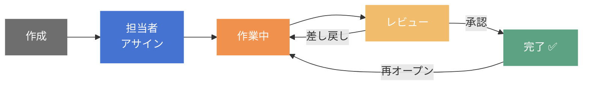

典型的なフロー:
1. PM が **タスク作成** (タイトル、説明、期限、優先度を設定)
2. タスクを **メンバーにアサイン**
3. 担当者が **作業開始** → ステータスを `in_progress` に
4. 完了したら **レビュー依頼** → `in_review` に
5. レビュアーが **承認** → `done` に / **差し戻し** → `in_progress` に戻る

### Asana が解決する課題

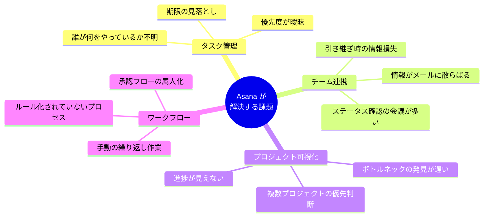

### 競合サービスとの比較

| 特徴 | Asana | Jira | Trello | Notion | Linear |
|------|-------|------|--------|--------|--------|
| メイン用途 | ワークマネジメント | ソフトウェア開発 | シンプルなカンバン | オールインワン | 開発チーム向け |
| ビュー | Board/List/Calendar/Timeline | Board/Backlog/Timeline | Board のみ | 自由度高 | Board/List |
| 粒度 | タスク/サブタスク | Epic/Story/Bug | カード | ページ/DB | Issue/Cycle |
| 強み | 非エンジニア向けの使いやすさ | 開発ワークフロー | シンプルさ | 柔軟性 | 速度・UX |
| 対象 | 全部門 | 開発チーム | 小規模チーム | 個人〜中規模 | スタートアップ |

### このクローンで実装したもの / していないもの

**✅ 実装済み:**
- ユーザー認証 (JWT)
- ワークスペース管理 (メンバー招待、ロール)
- プロジェクト CRUD (アーカイブ対応)
- セクション管理 (並び替え)
- タスク管理 (ステータス遷移、優先度、アサイン、ラベル)
- ボードビュー (ドラッグ&ドロップ)
- リストビュー
- コメント機能
- ダッシュボード

**🔜 未実装 (拡張候補):**
- サブタスク
- カレンダー/タイムラインビュー
- ファイル添付
- 通知 (リアルタイム WebSocket)
- カスタムフィールド
- テンプレート機能
- ワークフロー自動化 (ルールベース)
- ポートフォリオ (複数プロジェクトの俯瞰)
- AI 機能 (タスク自動生成、ステータス更新提案)
